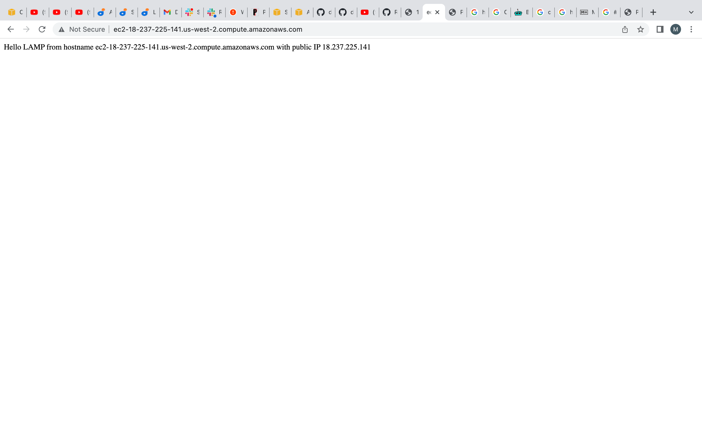
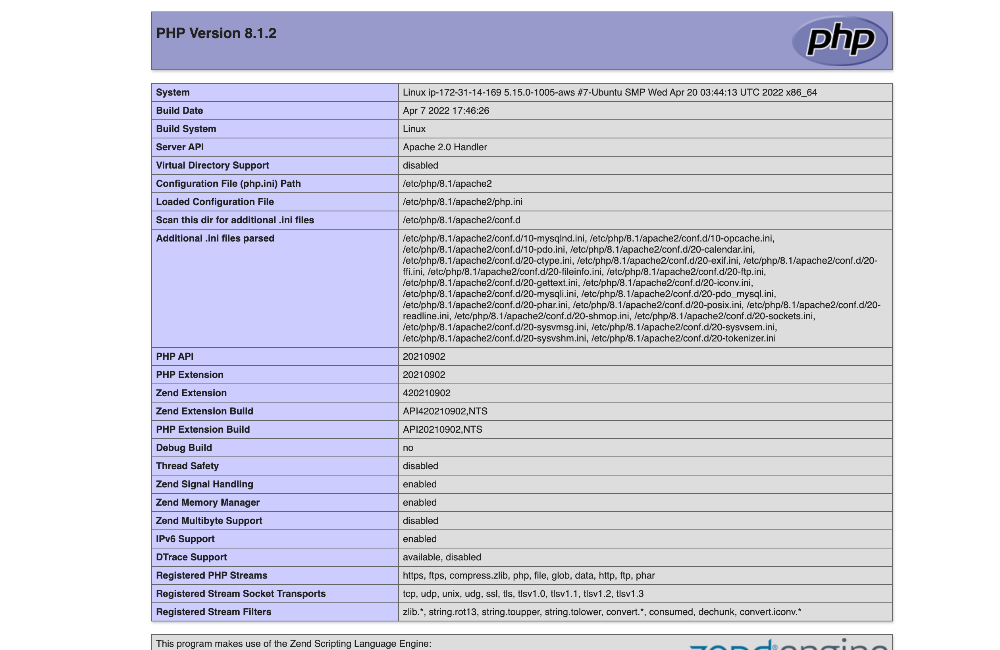

# Documentation of PROJECT 1: LAMP STACK IMPLEMENTATION

## Installation of Apache and updating the firewall.
- Installed Apache using Ubuntu’s package manager ‘apt’:

`sudo apt update`
`sudo apt install apache2`

- Confirmed that the apache2 is running as a service in my OS

`sudo systemctl status apache2`

## Installation of MYSQL to store and manage my site data

- Installed MYSQL 'apt':

`sudo apt install mysql-server`
`sudo mysql`

## Installation of php for processing code to display dynamic content to end user

- Installed PHP, PHP-MYSQL and libapache2-mod-php 

` apt install php libapache2-mod-php php-mysql`

- Confirmation of php version

`php -v`

## Creating a virtual host for website using apache

- Created the directory for projectlamp using ‘mkdir’ command as follows:

`sudo mkdir /var/www/projectlamp`

- Assigned ownership of the directory

` sudo chown -R $USER:$USER /var/www/projectlamp`

-   Created and opened a new configuration file in Apache’s sites-available directory

`sudo vi /etc/apache2/sites-available/projectlamp.conf`

- The above code created a new blank file so i pasted the text below and saved it then  closed the file.

<VirtualHost *:80>
    ServerName projectlamp
    ServerAlias www.projectlamp 
    ServerAdmin webmaster@localhost
    DocumentRoot /var/www/projectlamp
    ErrorLog ${APACHE_LOG_DIR}/error.log
    CustomLog ${APACHE_LOG_DIR}/access.log combined
</VirtualHost>

confirmed the new files in the site-available directory

`sudo ls /etc/apache2/sites-available`

- Enabled the new virtual host

`sudo a2ensite projectlamp`

- Disabled the defualt apache's website

`sudo a2dissite 000-default`

- Made sure the confirguration file doesnt contain syntax error

`sudo apache2ctl configtest`

- Reloaded the apache so the changes could take effect

`sudo systemctl reload apache2`

- Created an index.html file in /var/www/projectlamp to test that the virtual host works as expected

sudo echo 'Hello LAMP from hostname' $(curl -s http://18.237.225.141//latest/meta-data/public-hostname) 'with public IP' $(curl -s http://169.254.169.254/latest/meta-data/public-ipv4) > /var/www/projectlamp/index.html

Verified the Apache virtual host with the website URL using the IP address

The output shows that the Apache virtual host is working as expected.

## Enabling php on the website

- Created a new file index.php

`vim /var/www/projectlamp/index.php`

- Added the following php code to the file

`<?php
phpinfo();`

Confirmation of the PHP installation can be seen in the image below:

